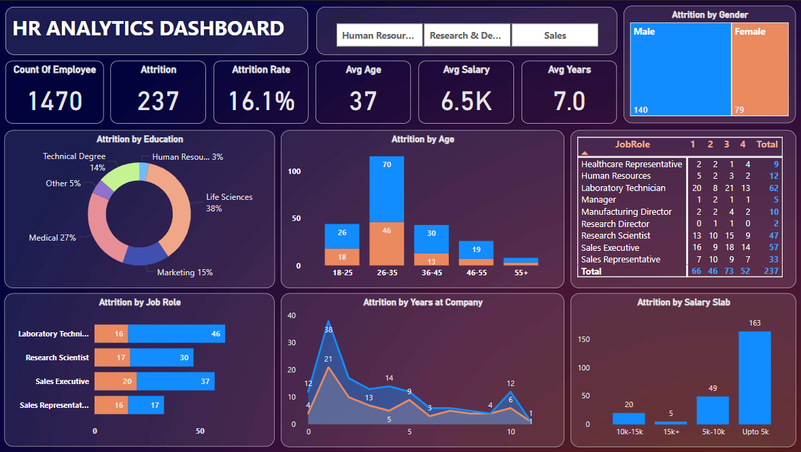

# 💼 HR Analytics Dashboard - Power BI

## Overview
The HR Analytics Dashboard provides an interactive and comprehensive view of employee attrition across various dimensions. It is designed to assist HR professionals in understanding trends and insights, enabling data-driven decision-making for employee retention and organizational planning.

---

## Key Features
- **Total Employees**: 📈 Displays the total number of employees in the organization.
- **Attrition Metrics**: 
  - 📉 Total attrition count.
  - 📊 Attrition rate as a percentage of total employees.
- **Employee Demographics**: 
  - 👤 Average age of employees.
  - 💰 Average salary in thousands (K).
  - 🕒 Average years of service in the organization.
- **Attrition Analysis by Categories**: 
  - **👩‍💼 Gender**: Breakdown of attrition by male and female employees.
  - **🎓 Education**: Proportion of attrition based on education backgrounds.
  - **🕒 Age Group**: Attrition segmented by age ranges.
  - **📚 Job Roles**: Attrition numbers across various job roles.
  - **📅 Years at Company**: Trends showing attrition by the number of years spent at the company.
  - **💰 Salary Slab**: Attrition distribution across salary brackets.

---

## Data Visualizations

### 1. **High-Level Metrics**
- 🔢 Located at the top of the dashboard, key metrics provide an at-a-glance overview:
  - **Count of Employees**: Total workforce (1,470 employees).
  - **Attrition**: Number of employees who have left the organization (237).
  - **Attrition Rate**: Percentage of attrition (16.1%).
  - **Avg Age, Avg Salary, Avg Years**: Key averages provide quick insights into the workforce.

### 2. **Attrition by Gender**
- 🔵 A bar chart visualizing the distribution of attrition by gender:
  - Male: 140.
  - Female: 79.

### 3. **Attrition by Education**
- 🌐 A pie chart showing the education background of employees who left:
  - Life Sciences: 38%.
  - Medical: 27%.
  - Technical Degree: 14%.
  - Marketing: 15%.
  - Others: 5%.
  - Human Resources: 3%.

### 4. **Attrition by Age**
- 🎨 A stacked bar chart breaking down attrition numbers by age group and gender:
  - 18-25: 26 (Male: 18, Female: 8).
  - 26-35: 70 (Male: 46, Female: 24).
  - 36-45: 30 (Male: 13, Female: 17).
  - 46-55: 19 (Male: 13, Female: 6).
  - 55+: 19 (Male: 19, Female: 0).

### 5. **Attrition by Job Role**
- 🌐 Horizontal bar charts visualizing attrition counts per job role:
  - Laboratory Technician: 62.
  - Research Scientist: 47.
  - Sales Executive: 57.
  - Sales Representative: 33.

### 6. **Attrition by Years at Company**
- 🕰 A line graph plotting attrition trends against years of service:
  - Highlights spikes in attrition during the 1st and 3rd years of tenure.

### 7. **Attrition by Salary Slab**
- 💵 Bar chart showing attrition across salary slabs:
  - Up to 5k: 163.
  - 5k-10k: 49.
  - 10k-15k: 20.
  - 15k+: 5.

---

## Insights Derived
1. **High Attrition Among Juniors**: 💪 Attrition peaks in the 26-35 age group and during the initial years of tenure.
2. **Gender Disparity**: 👩‍💼 Male employees exhibit higher attrition than females.
3. **Education Trends**: 🎓 Employees with Life Sciences and Medical backgrounds show higher attrition.
4. **Salary Impact**: 💰 Majority of attrition occurs in the lowest salary slab (up to 5k).
5. **Job Role Influence**: 📚 Sales and technical roles experience the highest attrition rates.

---

## Use Cases
- **Retention Strategies**: 🏢 Identify at-risk demographics and implement targeted retention programs.
- **Salary Adjustments**: 💰 Address attrition in lower salary brackets through competitive compensation.
- **Career Pathing**: 🎓 Focus on job roles with high attrition for growth opportunities and engagement.
- **Onboarding Improvements**: 👨‍💼 Reduce early-stage attrition with effective onboarding processes.

---
## Visuals 🗺️

HR Analysis Dashboard Demo

HR Analysis Dashboard Video

---

## How to Use the Dashboard
1. **Filters**: 🔃 Use the department filters (Human Resources, Research & Development, Sales) to narrow down data.
2. **Interact with Visuals**: 🔍 Hover over charts and graphs for detailed tooltips.
3. **Export Options**: 📄 Export reports and insights for further analysis and presentation.

---

## Technical Details
- **Tool Used**: 💻 Power BI.
- **Data Source**: 📈 Employee records from HRMS.
- **Refresh Schedule**: 🔄 Weekly data refresh.
- **Custom Visuals**: Includes pie charts, bar graphs, stacked bar charts, and line graphs.

---

## Future Enhancements
1. **Analysis dictive Analytics**: 🧠 Integrate machine learning to predict future attrition trends.
2. **Real-Time Data**: 🕐 Implement real-time data updates for dynamic decision-making.
3. **Drill-Down Capabilities**: 🔄 Allow detailed insights by department or location.
4. **Employee Feedback Integration**: 💬 Correlate attrition with survey results for qualitative insights.

---

